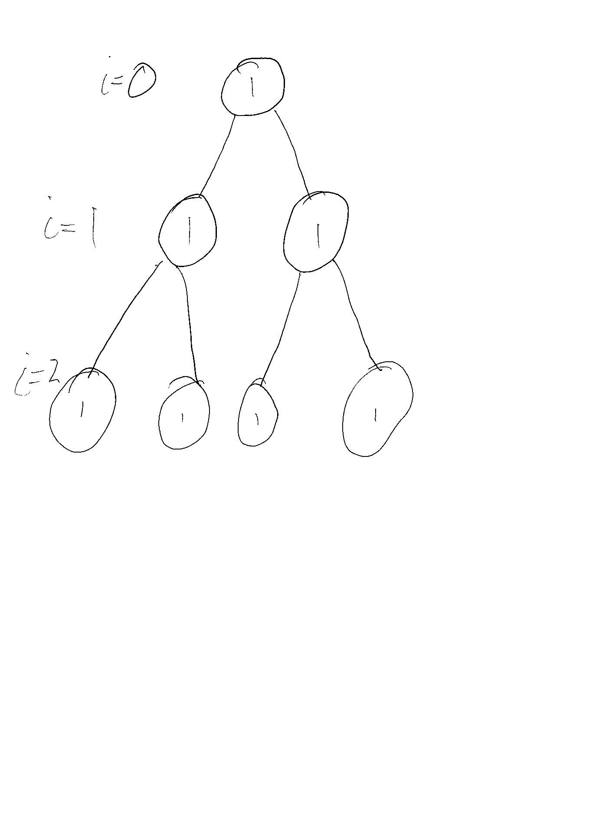

# Theoretical Exercise 1
## 1.1 Unix Processes and the shell
1. The init processes is the processes that all other processes are either direct or indirect descendents of, meaning its the first processes that starts on boot. Processes that are orphaned becomes the child of the init processes, and the init process is responsible for starting all other processes, such as daemons or services.
2. `execl` is a function in C that replaces the current process image (address space, PID and such) with a new process image. The new image comes from the first parameter in the function, namely the pathname of the file you wish to be executed. The second parameter is actually a "list" of parameters. These are pointers to null-terminated strings that are the arguments for the new process you want to run. The arguments must be terminated by a null-pointer.
3. `ls | grep -vc .pdf` takes the output of ls and pipes it into the grep command. The grep command searches for patterns in the output of ls, and more specific, with the `-vc` options it first "inverts" the result, meaning it matches on non-matching patterns, and then counts the amount of (non)matching records. `.pdf` is the pattern were searching for. The command would then count the number of files or directories that does not have the pdf file extension.
4. `grep root /etc/passwd > /tmp/x` should do the trick.

## 1.2 fork()
1. This while loop will expontentially create new processes. At the first, second and third iteration we will have 2, 4 and 8 processes running. For $n$ iterations we will have $2^n$ processes running. 
2. The problem that occurs is that all the available system resources will be used. Specifcaly the memory will be used up, and the computer will eventually crash. Upon reboot the computer will work fine again. A way one can prevent this in unix is to restrict how many processes one user can run at any given time. This will prevent a fork bomb. However, there could then be a possibility that legitimate processes, i.e proccesses run by root, could be  prevented from executing and running.

## 1.3 Process execution order
1. The initial processes will create one new processes, and we then have 2 processes at i=0. Then these two processes forks again, and we get 4 processes running at i=1. For the last iteration, each one of the processes creates a new child, meaning we get 8 processes. At the end of the loop iteration at i=2, the loop terminates, and we then have 8 programs that prints "Hello World".
