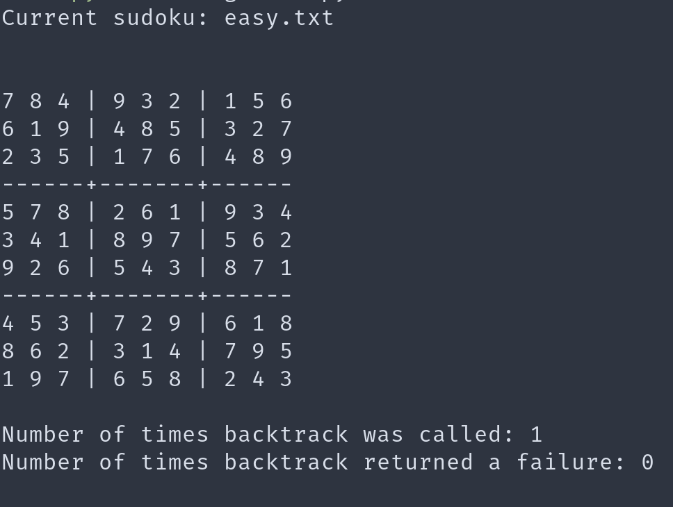

# Exercise 4

## Output from program (a and b)

### easy.txt

### medium.txt

### hard.txt

### veryhard.txt

## Reflection

In easy.txt backtrack is only called once, this is because the first inference call in `backtracking_search` solves the entire sudoku, since it's quite easy to infer all values when its easy.

For medium.txt we see that backtrack is called twice, meaning inference was called twice. Same as above, it's quite easy for a computer to infer values when we already have so many values.

For hard.txt we have a few more, but also here it's not a lot. A difference is that in this case, it actually tries values that gives a failure.

In veryhard.txt backtrack is called a lot more, and it also fails a lot more. This would probably be better if we had better domain value ordering, i.e choosing the value that rules out the fewest values for neighbors first. The inference could also be more optimized.

The difference between hard.txt and veryhard.txt is noticable. Perhaps for hard.txt we are "lucky" with the values we are choosing, resulting in few failures. Also with fewer values, it has to go through much more possibilities, as it's not linear.
