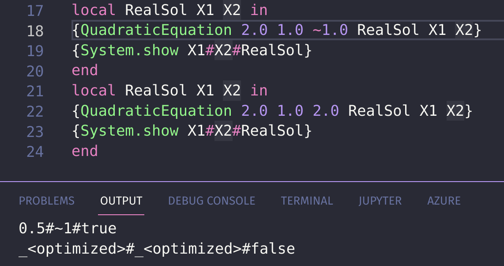

# Theory Question Exercise 3

## Task 1

### a

See comments in the code

### b

Here is an image of the output:

In the second call we don't bind X1 and X2 to a value.

### c

Procedural abstractions are useful because it allows for delaying execution of statements. They also allow for more flexibilty because they can have arguments, which can influence the behaviour of the procedure. This is important for building abstractions.

### d

A procedure does not return a value, while a function does.

## Task 2

See comments in code for implementation details.

## Task 3

### b

I will use the relative lines explaining this, i.e line 1 corresponds to the line `fun {...}`.

Line 1 is the function declaration. The `List` is the list we want to fold, `Op` is the operation, i.e a function, on the elements we wish to perform, and `U` is the neutral element, with respect to the operation defined by `Op`.

Line 2 and 3 is the recursion base case, meaning we have iterated over the list. The neutral element is then returned. We have to return the neutral element with respect to the operation, i.e for a plus operation (or entity) we have to return 0 so it does not affect the result.

Line 4 and 5 is the recursion step. We deconstruct the list using pattern matching and perform the operation on the element. The element will be de first argument in the `Op`-function, and the recursion will be the second value. We therefore "fold" right at each iteration. The recursion step is a call to the `RightFold` function, with `Rest` as the only changed parameter. This is because `Rest` represents the elements we have not performed `Op` on.

### c

See code for implementation

### d

No, it would not yield different results. This is because addition is associative. If we were to subtract, or even divide, a left-associative fold and right-associative fold might yield different results. This is because division and subtraction are not associative operations.

### e

The neutral element for multiplication is 1, since it does not effect result. For the product of all elements in the list, 1 has to be used as the neutral element.

## Task 4

See code for implementation.

## Task 5

### a

See code for implementation

### b

I thought my implementation would fail since I never terminate the list with `nil`, but it seems to work correctly. The idea is that `LazyNumberGenerator` returns a list where the first element is the parameter, i.e `StartValue`, and with a second element that is a function. This function calls `LazyNumberGenerator` with the argument `StartValue + 1`, to increment the list. We cannot call `LazyNumberGenerator` directly as the second element, since it then would work as a recursion, and never terminate. By returning a function in the second element, if you try `{{LazyNumberGenerator 0}.2}.1`, you would call the anonymous function, which creates a new list with an incremented value as the start value, giving you the illusion you have the list `[0, 1]`. In fact, you have the list `[1]`, since we in `{LazyNumberGenerator 0}.2` call the function to generate a new list.

## Task 6

### a and b

The `Sum` function implemented is not tail recursive. This is because in the call stack we would get something like `Sum(Sum(Sum(...))`, more generally, the stack would have to keep track of all the calls to the Sum function, which could lead to a stack overflow when you e.g have a very long list. In a tail recursive function, you make a recursive call, but you also send the data you have so far in the function. This way, when we have done a recursive call, the calling function can be freed from memory, since all the data we need is transfered down. `TailSum` shows a tail recursive implementaion of `Sum`.

In a more mathematical description, using tail recursion eliminates the `O(n)` space required for keeping track of the recursion calls. In fact, it reduces it to `O(1)`.

### c

For any language that can end a code block on the recursive call (i.e the recursive call is the tail), it will benefit from using tail-recursion, since it uses less space complexity.
