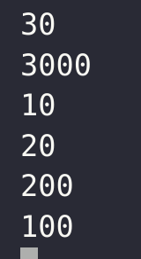
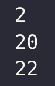

# Exercise 4

## Task 1

a)
The following sequence is printed:



b)
First `C` is printed, as it's the first instruction, it's expected it should be the first executed. Then we start 2 threads. The main thread continues, and the next that should be printed is `C * 100`, as it takes some time for the threads to set up (copy memory and such). The threads are practically initiated at the same time, and since the thread containing `A` is executed first, it is printed first, it then delays for 100 milliseconds. This gives time for the second thread to print `B`, before it also delays for 100 milliseconds. Since it's such a small delay between the thread initialization, it's not deterministic wheter `A * 10` or `B * 10` will print first. I ran the code a couple of times and it swapped places a couple of times, but the majority of the time, `B * 10` was printed first. This is possible because the processor in your PC internally does context switching, and its unclear when these switches. I would assume oz interrupts the processor, but as I mentioned above, the time between initilazation is so small, that the two threads might interrupt at the same time, and since it already is in the context of the second thread, it executes this first.

c)
The following sequence was the output.



d)
The program starts two threads. Since it takes some time to set up the threads, one could expect that the last lines in the main thread should have been executed first. However, we notice that `C` is dependent on both `A` and `B`. This means that this is data-driven concurrency. Since it depends on both `A` and `B`, it's executed last. We also notice that `B` is dependent on `A`, and this thread must wait for the value of `A` to be set. The value of `A` does not depend on anything, and is the first instruction that is executed. Then the second thread can execute, before the main thread is able to execute. In theory, a context switch could happen between the binding of variables and printing of the, but in practice this will rarely happen, and the execution of code "that matters", i.e binding of variables, will always be deterministic in this case.

## Task 2

a)

```oz
fun {Enumerate Start End}
  % helper function that enumerates from start to end, which we can later wrap
  % in a thread call.
  fun {Enum Start End}
    % check if we reached the end
    if (Start > End) then
      nil
    else
      % extend list
      Start|{Enum Start+1 End}
    end
  end in
  % wrap in thread for async
  thread {Enum Start End} end
end
```

b)

```oz
fun {GenerateOdd Start End}
  % helper function for consuming a list and filtering out even numbers.
  fun {Filter List}
    case List of Head|Tail then
      % filter out even numbers
      if ({Int.isOdd Head}) then
        Head|{Filter Tail}
      else
        % else just call the function again
        {Filter Tail}
      end
    else
      nil
    end
  end in
  % wrap helper functino in thread for async execution
  thread {Filter {Enumerate Start End}} end
end
```

## Task 3

a)

```oz
fun {ListDivisorsOf Number}
  % helper function that filters a list, creating a new list
  fun {Filter List}
    case List of Head|Tail then
      % check if its divisible by checking mod
      if ((Number mod Head) == 0) then
        Head|{Filter Tail}
      else
        % else recursively call on tail
        {Filter Tail}
      end
    else
      nil
    end
  end in
  % consumes Enumerate and produces a new list
  thread {Filter {Enumerate 1 Number}} end
end
```

\newpage

b)

```oz
fun {ListPrimesUntil N}
  % helper functions that checks if a number is a prime
  fun {IsPrime Num} L in
    % get list of divisors, if the first element is 1 and the last
    % is Num, then it's prime, else it's not prime.
    L = {ListDivisorsOf Num}
    case L of Head|Tail then
      if (Tail.1 == Num) then
        if (Head == 1) then
          true
        else
          false
        end
      else
        false
      end
    else
      false
    end
  end
  % helper function that consumes a stream, and collects the primes of that stream.
  fun {Filter List}
    case List of Head|Tail then
      % check if Head is a prime
      if ({IsPrime Head}) then
        % we then add it to the stream
        Head|{Filter Tail}
      else
        % just a recursive call
        {Filter Tail}
      end
    else
      nil
    end
  end in
  % base case, N < 2, 1 is not prime
  if (N < 2) then
    nil
  % base case N == 2, return a list only containing 2.
  elseif (N == 2) then
    2|nil
  % else start a thread and filter
  else
    thread {Filter {Enumerate 2 N}} end
  end
end
```

\newpage

## Task 4

a)

```oz
fun lazy {LazyEnumerate}
  % helper function, generate infinite list
  fun {Generate Next}
    Next|{Generate Next+1}
  end in
  % when called, a new thread will create the stream, starting from 1
  thread {Generate 1} end
end
```

\newpage

b)

```oz
fun lazy {Primes}
  fun {IsPrime Num} L in
    % get list of divisors, if the first element is 1 and the last
    % is Num, then it's prime, else it's not prime.
    L = {ListDivisorsOf Num}
    case L of Head|Tail then
      if (Head == Num) then
        true
      elseif ({And Tail.1 == Num Head == 1}) then
        true
      else
        false
      end
    else
      false
    end
  end
  % helper function that consumes a stream, and collects the primes of that stream.
  fun {Filter List}
    case List of Head|Tail then
      % check if Head is a prime
      if ({IsPrime Head}) then
        % we then add it to the stream
        Head|thread {Filter Tail} end
      else
        % just a recursive call
        thread {Filter Tail} end
      end
    else
      nil
    end
  end in
  
  % generate an infinite amount of primes
  thread {Filter {LazyEnumerate}} end
end
```
