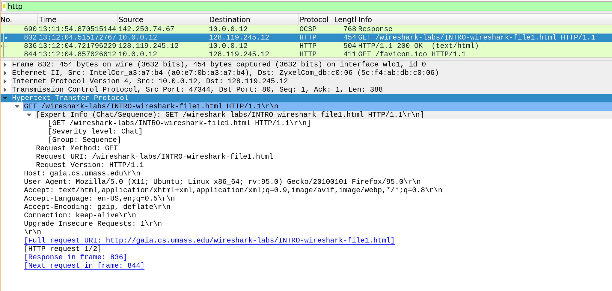
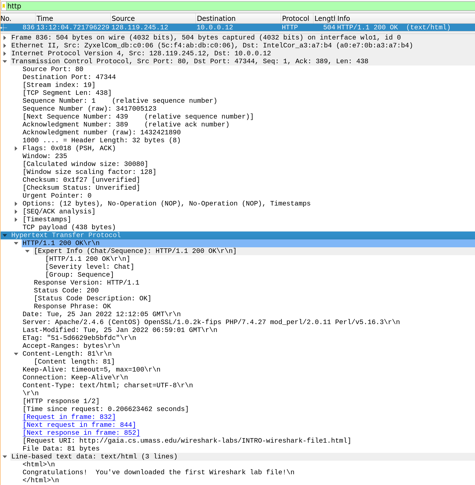

# Exercise 1

## 1

UDP, HTTP og TCP

## 2

It took approximately 0.2 seconds to receive the HTTP OK reply was received after sending the GET request. 

## 3

I interpret "internet address" as IP address, which in that case the IP address is 128.119.245.12.

My computers IP address is 10.0.0.12.

## 4 

It depends on what is meant, the total length of the packet captured is 504 bytes, while the TCP payload is 438 bytes.

The HTML file size is 81 bytes.

## 5

